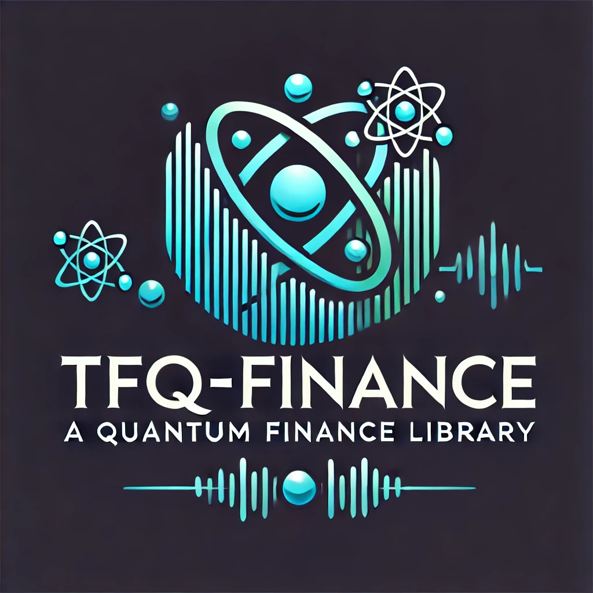

<div align=center>


[](https://badge.fury.io/py/tfq-finance)
[](https://opensource.org/licenses/Apache-2.0)


[](https://coveralls.io/github/jialuechen/tfq-finance?branch=main)
[](https://tfq-finance.readthedocs.io/en/latest/?badge=latest)

</div>


<div align=center>

# TFQ-Finance
   
</div>


TFQ-Finance is a cutting-edge quantum finance package built on TensorFlow Quantum. It provides a comprehensive suite of tools for financial modeling, risk management, portfolio optimization, and machine learning applications. This package leverages the power of quantum computing to deliver unprecedented performance and accuracy in financial analytics.

## Background on Quantum Finance

Quantum finance applies quantum computing and quantum information theories to solve complex financial problems. The primary advantage of quantum finance lies in its ability to process and analyze vast amounts of data at unprecedented speeds. Quantum algorithms can tackle problems that are infeasible for classical computers, such as optimizing large portfolios, pricing complex derivatives, and managing risk in real-time.

### Key Concepts

- **Quantum Computing**: Utilizes quantum bits (qubits) that can exist in multiple states simultaneously, enabling parallel computation.
- **Superposition**: A fundamental principle where a quantum system can be in multiple states at once.
- **Entanglement**: A quantum phenomenon where qubits become interconnected and the state of one qubit can depend on the state of another, no matter the distance between them.
- **Quantum Algorithms**: Specialized algorithms designed to run on quantum computers, such as Shor's algorithm for factoring and Grover's algorithm for searching.

### Applications in Finance

- **Option Pricing**: Quantum algorithms can enhance the accuracy and speed of pricing complex derivatives.
- **Risk Management**: Quantum computing can provide more precise risk assessments and stress testing.
- **Portfolio Optimization**: Quantum optimization algorithms can find the best asset allocations in large portfolios more efficiently than classical methods.
- **Machine Learning**: Quantum machine learning models can improve predictive accuracy and handle larger datasets.

## Key Features

- **Quantum-Enhanced Financial Modeling**: Utilize quantum algorithms for pricing options, bonds, and other derivatives, enhancing computational efficiency and accuracy.
- **Advanced Risk Management**: Robust tools for calculating Value at Risk (VaR), Conditional Value at Risk (CVaR), stress testing, and economic capital modeling.
- **Portfolio Optimization**: State-of-the-art optimization techniques including risk parity, factor investing, and multi-period optimization.
- **Machine Learning Integration**: Incorporate quantum machine learning models for regression, classification, clustering, and reinforcement learning.
- **Execution and Trading**: Comprehensive modules for order placement, optimal execution, high-frequency trading, and algorithmic trading strategies.
- **Data Utility Tools**: Extensive utilities for data loading, preprocessing, visualization, and performance metrics.

## Advantages

- **High Performance**: Quantum computing significantly reduces the time complexity of many financial algorithms.
- **Scalability**: Capable of handling large datasets and complex computations with ease.
- **Accuracy**: Quantum models provide more precise results compared to classical methods.
- **Comprehensive Coverage**: Covers a wide range of financial instruments and applications, making it a one-stop solution for quantitative finance.

## Installation

```bash
pip install tfq-finance
```

## Usage

### Example: Option Pricing

```python
from tfq_finance.pricing.equity.option_pricing import price_option

spot_price = 100
strike_price = 105
time_to_maturity = 1
volatility = 0.2
risk_free_rate = 0.05

option_price = price_option(spot_price, strike_price, time_to_maturity, volatility, risk_free_rate)
print("Option Price:", option_price)
```

### Example: Portfolio Optimization

```python
import numpy as np
from tfq_finance.optimization.portfolio_optimization import optimize_portfolio

returns = np.random.randn(100, 4)
risk_aversion = 0.5

optimal_weights = optimize_portfolio(returns, risk_aversion)
print("Optimal Portfolio Weights:", optimal_weights)
```

### Example: Quantum Regression

```python
import numpy as np
from tfq_finance.machine_learning.quantum_regression import train_quantum_regression_model

train_data = np.random.randn(100, 4)
train_labels = np.random.randn(100)

model = train_quantum_regression_model(train_data, train_labels)
print("Quantum Regression Model Trained")
```

### Example: Credit Risk Management

```python
from tfq_finance.risk_management.credit_risk import calculate_credit_value_at_risk

exposure = 1000000
probability_of_default = 0.02
confidence_level = 0.95

cvar = calculate_credit_value_at_risk(exposure, probability_of_default, confidence_level)
print("Credit Value at Risk:", cvar)
```

### Example: Liquidity Management

```python
import numpy as np
from tfq_finance.optimization.liquidity_management import manage_liquidity

cash_flows = np.random.randn(100)
liquidity_needs = 0.05

liquidity_plan = manage_liquidity(cash_flows, liquidity_needs)
print("Liquidity Management Plan:", liquidity_plan)
```

### Example: Exotic Option Pricing

```python
from tfq_finance.pricing.exotic.exotic_option_pricing import price_exotic_option

spot_price = 100
strike_price = 105
time_to_maturity = 1
volatility = 0.2
risk_free_rate = 0.05

exotic_option_price = price_exotic_option(spot_price, strike_price, time_to_maturity, volatility, risk_free_rate)
print("Exotic Option Price:", exotic_option_price)
```

### Example: Spread Option Pricing

```python
from tfq_finance.pricing.commodities.spread_option_pricing import price_spread_option

spot_price1 = 50
spot_price2 = 55
strike_price = 5
time_to_maturity = 1
volatility1 = 0.2
volatility2 = 0.25
correlation = 0.5
risk_free_rate = 0.05

spread_option_price = price_spread_option(spot_price1, spot_price2, strike_price, time_to_maturity, volatility1, volatility2, correlation, risk_free_rate)
print("Spread Option Price:", spread_option_price)
```

### Example: High Frequency Trading

```python
import numpy as np
from tfq_finance.execution.high_frequency_trading import high_frequency_trading_signal

prices = np.array([100, 101, 102, 101, 100, 99, 100])
signal = high_frequency_trading_signal(prices)
print("High Frequency Trading Signal:", signal)
```

### Example: Smart Order Routing

```python
from tfq_finance.execution.smart_order_routing import smart_order_routing

order = {'quantity': 100, 'type': 'market'}
venues = {'Venue A': 100.5, 'Venue B': 100.3, 'Venue C': 100.7}

best_venue, best_price = smart_order_routing(order, venues)
print(f"Best Venue: {best_venue}")
print(f"Best Price: {best_price}")
```

## Roadmap

### Upcoming Features

1. **Enhanced Machine Learning Models**:
   - Quantum Support Vector Machines
   - Quantum Random Forests
   - Quantum Boosting Algorithms

2. **Expanded Financial Instruments**:
   - Support for additional exotic options
   - Enhanced credit derivatives modeling including CDS indexes and tranche pricing

3. **Integration with Classical Models**:
   - Hybrid quantum-classical algorithms for improved performance
   - Interfaces with popular classical finance libraries for seamless integration

4. **Improved Data Handling and Visualization**:
   - Advanced data preprocessing and feature engineering tools
   - Enhanced visualization capabilities for better insights

5. **Execution and Trading Algorithms**:
   - Support for more sophisticated algorithmic trading strategies
   - Real-time data handling for high-frequency trading

### Long-Term Goals

- **Quantum Optimization Algorithms**: Developing new quantum algorithms specifically for financial optimization problems.
- **AI and Quantum Synergy**: Integrating AI and quantum computing to create intelligent financial models that can learn and adapt over time.
- **Community Contributions**: Encouraging contributions from the community to expand the package and incorporate the latest research findings.

## Contributing

We welcome contributions from the community. Please read our [contributing guidelines](CONTRIBUTING.md) to get started.

## License

This project is licensed under the Apache-2.0 License - see the [LICENSE](LICENSE) file for details.

We believe that TFQ-Finance will revolutionize the way financial analysis and modeling are done, bringing the power of quantum computing to the world of finance.
